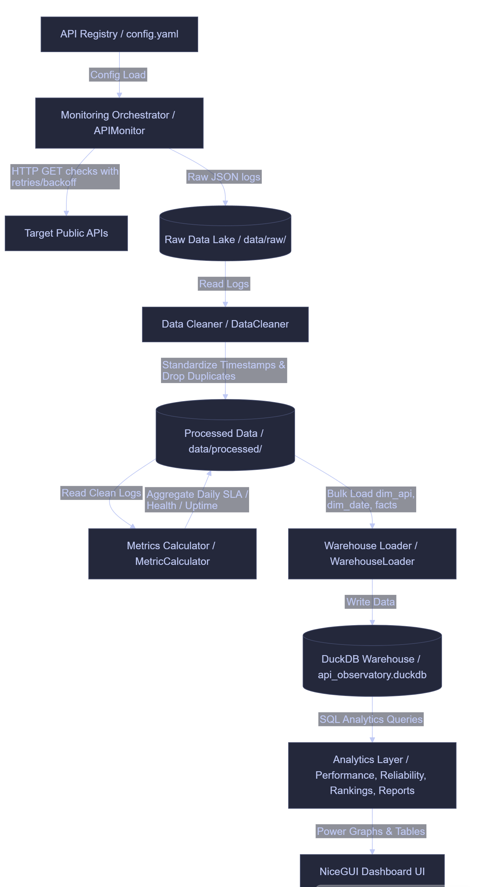

# API Observatory

### API Monitoring, Reliability Analytics & Developer Intelligence Platform

API Observatory is a production-style API health tracking and data warehousing platform. It continuously monitors public API endpoints (GitHub, SpaceX, StackExchange, CoinGecko, OpenLibrary, JSONPlaceholder), cleans checking logs, aggregates reliability metrics daily, and maintains a DuckDB dimensional star schema to power analytics and a premium dark-themed NiceGUI status dashboard.

---

### Screenshots


## System Architecture


---

## Core Features & Workflow

1. **Robust Monitoring Engine**:
   - Resilient HTTP check checks with configurable timeout limits.
   - Exponential backoff retry logic (up to 3 retries) to withstand intermittent network blips.
   - Automatic capturing of response size (bytes), latency (ms), status codes, and connection failures.
2. **Aggregations & KPI Arithmetic**:
   - **SLA Score**: `successful_requests (2xx status code) / total_requests * 100`
   - **Uptime Percentage**: `available_checks (status code < 400) / total_checks * 100`
   - **Error Rate**: `failed_checks / total_checks * 100`
   - **Reliability Score**: `uptime_percentage * 0.70 + SLA_score * 0.30`
   - **Health Score**: `100 - (error_rate * 1.5) - min(50, average_latency_ms / 100)`
3. **DuckDB Star-Schema Warehouse**:
   - `dim_api`: API key, API name, URL, and category.
   - `dim_date`: Date key (YYYYMMDD), full date, month, quarter, and year.
   - `fact_api_checks`: Check key, API key, Date key, status code, latency, size, and availability.
   - `fact_api_metrics`: Metric key, API key, Date key, SLA, reliability, health, uptime %, error rate %, and average latency.
4. **Synthetic History Simulator**:
   - Generates 30 to 90 days of realistic history logs with seasonal weekend latency, random outages, and API specific errors (e.g. rate-limiting 429s on CoinGecko) to make charts populate immediately on first run.

---


## Deployment & Setup Guide

### 1. Prerequisites
- Python 3.12+ installed.
- Pip package manager.

### 2. Install Dependencies
```bash
pip install -r requirements.txt
```

### 3. Run Pipeline with Simulation
To populate 30 days of historical data and boot up the server:
```bash
python run_pipeline.py --simulate
```
*The simulation generated 30 days of daily log logs (~30,000 checks across 6 endpoints) to feed charts immediately.*

### 4. Running the Pipeline Periodically
The orchestrator starts a background scheduler automatically when NiceGUI is running. You can also run it headless as a cron task or loop runner:
```bash
python run_pipeline.py --no-ui
```

### 5. Running Tests
To run the full unit and integration test suite:
```bash
python -m pytest --cov=src --cov-report=term-missing
```
---

## Future Improvements
- **Live WebSocket Alerting**: Integrate Slack/Discord webhook alerts if availability drops below a critical threshold.
- **Multi-region Check Nodes**: Deploy worker subprocesses in different regions to monitor latency from different parts of the world.
- **DuckDB Partitioning**: Partition the raw files and fact tables by year/month to optimize scale performance for multi-year retention.
